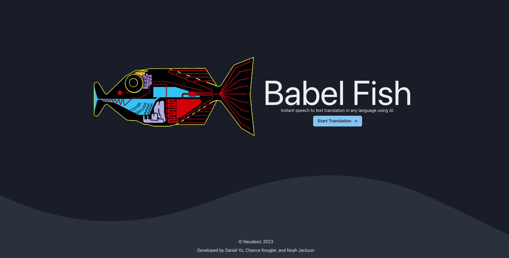
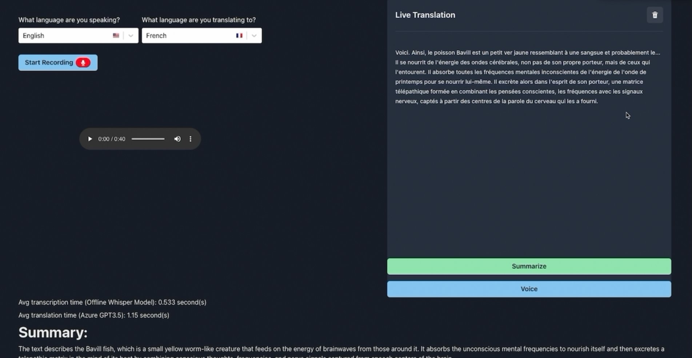

# Hackathon: Live audio stream translation

Real time voice translation utilizing OpenAI's Whisper for transcript and ChatCompletion for translation.





## Features

- From a dropdown, select your spoken language and the language you want to translate to
- `Speech to text transcription & Translation` - Once you begin recording, Whisper and GPT3.5 will attempt to translate each word you speak in real-time
- `Summarize` - Once you are done recording, stop the recording and you will be able to summarize the transcription
- `Voice` - _buggy_. Once you are done speaking, stopping the recording session will give you an option for `Voice`. Which will read the translated text out via the TTS feature

## AI Models

- [Whisper Open Source Model](https://github.com/openai/whisper)
- [GPT3.5-Turbo through Azure](https://learn.microsoft.com/en-us/azure/cognitive-services/openai/chatgpt-quickstart?tabs=command-line&pivots=programming-language-python)
- [ElevenLabs](https://beta.elevenlabs.io/voice-lab) - VoiceAI

## Running locally

### Setup Backend

Requirements:

- **Python version 3.9+** - [Download](https://www.python.org/downloads/)
- **FFmpeg**
  - Mac: `brew install ffmpeg`
  - Windows: follow this [README](https://github.com/openai/whisper#:~:text=It%20also%20requires%20the%20command%2Dline%20tool%20ffmpeg%20to%20be%20installed%20on%20your%20system%2C%20which%20is%20available%20from%20most%20package%20managers%3A)

Setup:

- Follow the [Backend README](./backend/README.md) for further steps

Run the websocket server:

- run `cd backend`
- run `python3 main.py`

### Setup Frontend

Requirements:

- Yarn
- Node (v16+)

Setup:

- run `cd frontend`
- run `yarn install`

Run the WebApp:

- run `yarn start`

# BUGS

- App is very much unstable and not consistent.
- Occasionally will skip words or phrases due to race condition
- Timeout issue with Azure GPT3.5 API calls sometimes

```json
INFO - error_code=Timeout error_message='The operation was timeout.' error_param=None error_type=None message='OpenAI API error received' stream_error=False
Error during translate:  The operation was timeout. { "error": { "code": "Timeout", "message": "The operation was timeout." } } 408 {'error': {'code': 'Timeout', 'message': 'The operation was timeout.'}} {'Content-Length': '75', 'Content-Type': 'application/json', 'apim-request-id': 'a0cecbef-1a20-406e-850a-138d89755b6c', 'Strict-Transport-Security': 'max-age=31536000; includeSubDomains; preload', 'x-content-type-options': 'nosniff', 'x-ms-region': 'South Central US', 'Date': 'Tue, 28 Mar 2023 19:15:28 GMT'}
```

# Reference

- [Our Design board](https://miro.com/app/board/uXjVMYdu0gI=/?share_link_id=292311427256)
- [DeepL Translator](https://www.deepl.com/translator#es/en/%C2%A1Hola%20Testing!%20Esta%20es%20la%20aplicaci%C3%B3n%20Babelfish%20que%20transcribir%C3%A1%20tu%20audio%20en%20vivo%20y%20lo%20traducir%C3%A1%20al%20mismo%20tiempo.%20Lo%20siento%2C%20no%20voy%20a%20traducir%20ese%20mensaje%20ya%20que%20contiene%20violencia%20y%20no%20es%20apropiado.) - Helpful during our testing process to measure accuracy of translated text
